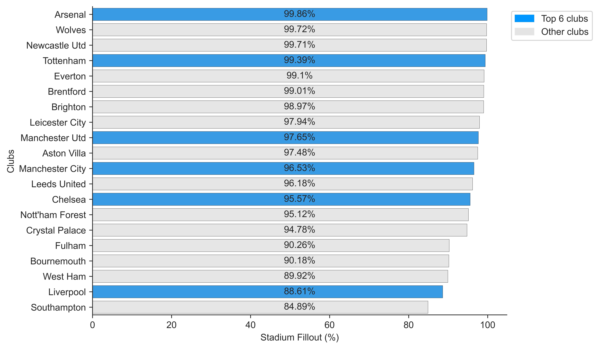

# Football_Data_Analysis_-_Visualization
## General Info
Just my random side projects for Football Data Analysis and Visualization using Pandas, Numpy, Seaborn, Matplotlib etc. Data here used is from FBref and Understat etc and using web scrapping for data.

## Visualizations:
### Stadium Fillout % in EPL 2022/23 season

### Top Dribblers in Top 5 European Leagues

### Premier League 22/23 season xPts Differential

## Acknowledgment
Special thanks to [SonOfaCorner](https://github.com/sonofacorner) for helping me out for matplotlib visualization and providing datas.
